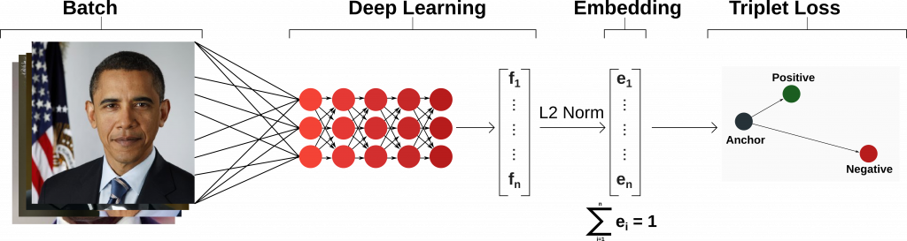

# SIMPLE FACENET
Lê Thanh Lợi - CK19V7K514
Colect data and push it into ```your_face``` as bellow:
```buildoutcfg
your_face/
├── TranThanh
│   ├── TranThanh_001.jpg
│   ├── TranThanh_0002.jpg
│   ├── ...
│   ├── TranThanh_0014.jpg
│   └── TranThanh_0015.jpg
├── HariWon
│   ├── HariWon_001.jpg
│   ├── HariWon_0002.jpg
│   ├── ...
│   ├── HariWon_0014.jpg
│   └── HariWon_0015.jpg
├── ChiPu
│   ├── ChiPu_001.jpg
│   ├── ChiPu_0002.jpg
│   ├── ...
│   ├── ChiPu_0014.jpg
│   └── ChiPu_0015.jpg
├── HienHo
│   ├── HienHo_0001.jpg
│   ├── HienHo_0002.jpg
│   ├── ...
│   ├── HienHo_0014.jpg
│   └── HienHo_0015.jpg
└── TruongGiang
    ├── TruongGiang_0001.jpg
    ├── TruongGiang_0002.jpg
    ├── ...
    ├── TruongGiang_0015.jpg
    └── TruongGiang_0016.jpg
```

### 2. Install requirements:
Install requirements ```pip install -r requirements.txt```

### 3. Download pretrain model:
Download [VGGFace2](https://drive.google.com/file/d/1yfzIrs3ewXnCskdPgyyVAsH89IpNO0JQ/view?usp=sharing) and unzip into ```models```, result as bellow:
```python
models
├── 20180402-114759.pb
├── model-20180402-114759.ckpt-275.data-00000-of-00001
├── model-20180402-114759.ckpt-275.index
└── model-20180402-114759.meta

```

### 4. Training:
run ```train.py```. In this file, we will run 2 module:<br>
```python
align_mtcnn('your_face', 'face_align')
train('face_align/', 'models/20180402-114759.pb', 'models/your_model.pkl')
```
- ```align_mtcnn``` use MTCNN (Multi-task Cascaded Convolutional Networks) to find face and crop.

(image cre: [kpzhang93.github.io](https://kpzhang93.github.io/MTCNN_face_detection_alignment/))
- ```train``` facenet 

(image cre: [towardsdatascience](https://towardsdatascience.com/a-facenet-style-approach-to-facial-recognition-dc0944efe8d1))
### 5. Detection:
run ```detection.py```
```python
if __name__ == '__main__':
    run('models', 'models/your_model.pkl', video_file='demo.mp4', output_file='demo.avi')
```

```video_file=None``` if you want to run internal camera.
